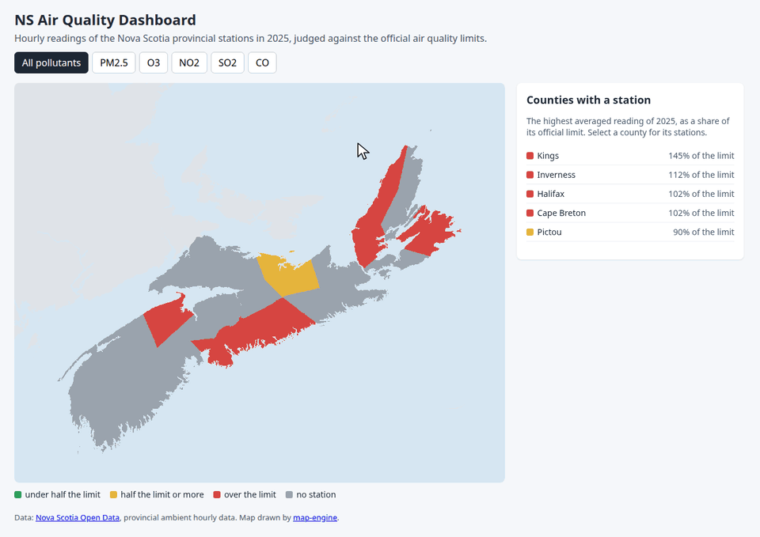

# NS Air Quality Dashboard



[Live demo](https://travisduffy.github.io/ns-air-quality-dashboard/)

A dashboard of Nova Scotia broken down by each monitoring station by its air quality. It compares sixteen years of hourly readings, 2010 - 2025, from the seven provincial monitoring stations with official air quality limits.

## Why

Nova Scotia publishes a lot of open data, and I wanted to build something with it. The air quality data stood out - stations across NS measure the air every hour, and the province publishes the checked readings each year for anyone to download. Air quality affects everyone who breathes (that's pretty much everyone!), so this data deserves a clear picture.

## How

A script downloads the hourly readings from [Nova Scotia Open Data](https://data.novascotia.ca). A second script compares them with the limits of the Nova Scotia Air Quality Regulations and the Canadian Ambient Air Quality Standards.

The page is a static React app in TypeScript, built with Vite. Each station and its county is green, yellow, or red by the official 3-year statistic of its limit: red is over the limit, green is within it, and yellow is a pollutant with no official limit. A gray county has no station (yet!). Pick a station or a county to see its hourly readings for the year, and pick one pollutant to see its daily readings for every year. My work-in-progress map library, [map-engine](https://github.com/travisduffy/map-engine), powers the map. A copy of it is in `vendor/map-engine/`.

## Run it

You need Node.js 24 or later.

```bash
npm ci
npm run dev
```

Open `http://127.0.0.1:3000/ns-air-quality-dashboard/`. To download the data again & rebuild the results, run `npm run data`. To run the tests, run `npx playwright install chromium` once, then `npm test`.

## License

MIT. See `LICENSE`.
